# Financiart 

`Trabalho Interdisciplinar - Aplicacões Web`

`Ciência da Computação`

`1° Semestre`

## Participantes

> Os membros do grupo são: 
> - Vitor Manoel Silva
> - Gabriel Rezende da Silva Maia
> - Fernando Theodoro Porto de Paula Dias

## Professores Responsáveis

> - Luciana Mara Freitas Diniz
> - Rafael Glater da Cruz Machado
> - Rommel Vieira Carneiro

# Estrutura do Documento

- [Informações do Projeto](#informações-do-projeto)
  - [Participantes](#participantes)
- [Estrutura do Documento](#estrutura-do-documento)
- [Introdução](#introdução)
  - [Problema](#problema)
  - [Objetivos](#objetivos)
  - [Justificativa](#justificativa)
  - [Público-Alvo](#público-alvo)
- [Especificações do Projeto](#especificações-do-projeto)
  - [Personas, Empatia e Proposta de Valor](#personas-empatia-e-proposta-de-valor)
  - [Histórias de Usuários](#histórias-de-usuários)
  - [Requisitos](#requisitos)
    - [Requisitos Funcionais](#requisitos-funcionais)
    - [Requisitos não Funcionais](#requisitos-não-funcionais)
  - [Restrições](#restrições)
- [Projeto de Interface](#projeto-de-interface)
  - [User Flow](#user-flow)
  - [Wireframes](#wireframes)
- [Metodologia](#metodologia)
  - [Divisão de Papéis](#divisão-de-papéis)
  - [Ferramentas](#ferramentas)
  - [Controle de Versão](#controle-de-versão)
- [**############## SPRINT 1 ACABA AQUI #############**](#-sprint-1-acaba-aqui-)
- [Projeto da Solução](#projeto-da-solução)
  - [Tecnologias Utilizadas](#tecnologias-utilizadas)
  - [Arquitetura da solução](#arquitetura-da-solução)
- [Avaliação da Aplicação](#avaliação-da-aplicação)
  - [Plano de Testes](#plano-de-testes)
  - [Ferramentas de Testes (Opcional)](#ferramentas-de-testes-opcional)
  - [Registros de Testes](#registros-de-testes)
- [Referências](#referências)

# Introdução

## Problema

A maioria da população brasileira não teve uma educação financeira ao longo da vida, e muitas mesmo já tendo ouvido falar sobre esse tema, acham que é de pouca importância e deixam ele de lado. Mas ao contrário do que a maioria dessas pessoas pensam, essa falta de educação financeira acaba prejudicando e muito a vida social, econômica e profissional dessas pessoas e consequentemente de todos aos seu redor. Além disso, é um mercado pouco inflamado pela mídia, ou seja, esse conhecimento não tende a chegar na grande parte da população, deixando a merce esse ramo fundamental da sociedade.

## Objetivos

O financiart tem o objetivo de trazer uma gestão finaceira para os usuários, com indicações de investimentos em ativos pressupostos para determinado perfil, além de indicativos de como gerir os gastos e as dívidas, projetando e alinhando os objetivos de cada usuário com sua determinada carteira. E além disso, buscamos um ensinamento educativo sobre o mercado e modos de causar interesse e curiosidade nos usuários. 

## Justificativa

As principais motivações vieram da grande negligência da sociedade em relação a adquirir conhecimento financeiro e entender como o dinheiro funciona, e do enorme potencial/impacto que essa área pode causar na vida de qualquer cidadão. É nítido que a maioria da população tem problemas com dinheiro, e geralmente nesses casos não é somente pela falta dele, mas sim da má gestão que essas pessoas fazem, deixando acumular dívidas, tendo mais despesas do que lucro, não sabendo como investir para ter umarenda extra, entre outros. Com isso, as pessoas podem escolher entre duas vertentes, fazer com que os dinheiro seja seu aliado, ou torna-lo seu maior inimigo. E é ai que nós(Financiart) entramos...     

## Público-Alvo

A maioria das pessoas possuem problemas com dinheiro, independente da classe social que ela pertence, por isso, grande parte das pessoas poderiam ser futuros usuários da nossa solução. No entanto, selecionamos um público alvo para focar e conseguir aprofundar as ideias e sugestões.

Nosso público alvo é composto de pessoas com a faixa etária de 23-35 anos que não possuem educação financeira e estão dispostas a investirem seu dinheiro visando o futuro, além de pessoas radicais que fazem má gestão do dinheiro e por fim pessoas que acham que não conseguem investir por ter um baixo salário.

# Especificações do Projeto

Nessa parte utilizamos o medo de Design Thinking para filtrar as personas utilizadas como parâmetros de proposta de valor, além de entrevistas com potenciais usuários e feedbecks interativos que ajudam a esclarecer ideias.

## Personas, Empatia e Proposta de Valor

Toda essa área está disponível e melhor explicada no ambiente miro. Para acessar é só abrir esse link no navegador:https://miro.com/app/board/uXjVMYDTJcA=/
Como falado em cima, nesse ambiente será detalhado as personas e suas proposta de valores.

1.**Maria Silva** tem 35 anos e é secretária de uma pequena empresa, ela tem dificuldades para controlar seus gastos e frequentemente gasta mais do que ganha e com isso sonha com uma vida em que não precise mais se preocupar com dívidas e possa viver de forma mais tranquila e independente. Maria gostaria de ter uma vida financeira mais estável e segura, com uma poupança para emergências e uma perspectiva de economizar para a aposentadoria. E para ela conseguir tudo isso, tem em mente que vai precisar de ajuda para dquirir conhecimento sobre gestão financeira.

2.**João da Silva** tem 32 anos e é um trabalhador autônomo que faz pequenos serviços de manutenção e reparo em residências. Ele aprendeu esse ofício com o pai, que também era autônomo, mas nunca teve uma formação técnica na área. João sempre teve dificuldades em controlar suas finanças, mesmo quando trabalhava em empregos formais.Com isso, ele e sua esposa sonham em comprar uma casa própria e ter uma reserva financeira para emergências. João também quer investir em sua empresa de manutenção residencial para poder aumentar sua renda, além de dar uma qualidade de vida melhor para seu filho.

3.**Lucas Araújo** tem 25 anos e está cursando o último período de Engenharia Civil, e por isso é estagiário em uma empresa da área. Ele é determinado, inteligente e criativo. Ele gosta de aprender coisas novas e de se desafiar. Ele também é sociável e comunicativo, mas às vezes se sente inseguro e ansioso. Ele tem como objetivo ter uma visão geral e detalhada de suas receitas e despesas, fazer um planejamento financeiro, definindo metas, orçamentos e limites de gastos, além de conseguir uma ajuda de como gerir suas dívidas. Tudo isso para no futuro realizar seu sonho de trabalhar em uma empresa reconhecida e inovadora na área de engenharia civil, como a Odebrecht ou a Camargo Corrêa e no futuro ter sua própria empresa ou consultoria de engenharia civil.

## Histórias de Usuários

|EU COMO... `PERSONA`| QUERO/PRECISO ... `FUNCIONALIDADE` |PARA ... `MOTIVO/VALOR`                 |
|--------------------|------------------------------------|----------------------------------------|
|Maria da Silva      |de gestão específica                |fazer com que meu balanço mensal seja   |
|                    |                                    |positivo e que sobre uma certa quantia  |
|                    |                                    |de dinheiro                             |
|Maria da Silva      |de conhecimento e ajuda financeira  |quitar minhas dívidas e não acumular    |
|                    |                                    |mais                                    |
|Maria da Silva      |recomendações de como guardar pelo  |investir em ativos com baixo risco      |
|                    |menos 5% da receita que recebo      |                                        |
|João da Silva       |um modelo de aprimoramento com as   |ter maior conhtrole sobre meu lucro no  |
|                    |minhas despesas                     |fim do mês                              |
|João da Silva       |um aconselhamento e conhecimento de |acabar com minhas dívidas pendentes     |
|                    |gestão                              |                                        |
|João da SIlva       |de um modelo de carteira recomendado|conseguir uma segunda renda mensal      |          
|                    |                                    |                                        |
|Lucas Araújo        |de páginas de indicações financeiras|montar minha carteira de investimentos  |
|                    |                                    |                                        | 
|Lucas Araújo        |um modelo de como abaixar minhas    |poder focar no meu futuro e não ficar   |
|                    |dívidas                             |preso ao passado                        |
|Lucas Araújo        |de um modelo de carteira de ativos  |ganhar uma renda extra e me ajudar      |
|                    |                                    |economicamente                          |     

## Requisitos

As tabelas que se seguem apresentam os requisitos funcionais e não funcionais que detalham o escopo do projeto.

### Requisitos Funcionais

|ID    | Descrição do Requisito  | Prioridade |
|------|------------------------------------------------------|----|
|RF-001| Permitir que o usuário cadastre suas informações financeiras e especifique certos tipos de dados | ALTA | 
|RF-002| Disponibilizar uma página com notícias atuais sobre o mercado econômico | ALTA |
|RF-003| Disponibilizar uma página com detalhamento sobre caa tipo de investimento e seus principais ativos | ALTA |
|RF-004| Recomendações de investimentos a partir do perfil de cada usuário | BAIXA |
|RF-005| Um espaço destinado a gestão de gastos e receita | ALTA |
|RF-006| Um sistema de monitoramento da carteira dos usuários | BAIXO |
|RF-007| Modelos de carteira pré-definidas como exemplo para o usuário | BAIXA |
|RF-008| Perfis pré-definidos de acordo com as informações de cada usuário | MÉDIA |
|RF-009| O site deve permitir que usuários façam pesquisas de ativos | MEDIA |

### Requisitos não Funcionais

|ID     | Descrição do Requisito  |Prioridade |
|-------|-------------------------|----|
|RNF-001| O sistema deve ser responsivo para rodar em todos os dispositivos | ALTA | 
|RNF-002| Deve ser acessível para que qualquer usuário possa se conectar de diversos dispositivos incluindo mais antigos | ALTA |
|RNF-003| Todo usuário deverá perceber as funcionalidades de cada página sem esforço | MÉDIA |
|RNF-004| A interface deve ser limpa e passar confiança para o usuário | ALTA |
|RNF-005| O aplicativo deve ter um padrão de linguagem e uma cor definida e marcante | MÉDIA |
|RNF-006| O site deve ser publicado em um ambiente acessível publicamente na Internet (Repl.it, GitHub Pages, Heroku) | ALTA |
|RNF-007| O site deve ser compatível com os principais navegadores do mercado | ALTA |

## Restrições

O projeto está restrito pelos itens apresentados na tabela a seguir.

|ID| Restrição                                             |
|--|-------------------------------------------------------|
|01| O projeto deverá ser entregue até o final do semestre |
|02| Não pode ser desenvolvido um módulo de backend        |
|03| O projeto não pode ser tercerizado                    |
|04| Não deve ser feito aportes financeiros no site        |

# Projeto de Interface
O projeto tem como objetivo criar uma experiência intuitiva e fácil de usar para ajudar os usuários a gerenciar suas finanças e investimentos.
A plataforma terá uma série de recursos que vão desde o cadastro das informações financeiras dos usuários até a disponibilização de notícias e detalhamento sobre os tipos de investimento. Além disso, será possível ter um espaço para gestão de gastos e receita, bem como um sistema de recomendações de investimentos baseado no perfil de cada usuário.
Para atender a essas necessidades, nossa equipe irá desenvolver uma interface moderna e intuitiva, com uma navegação clara e simples. Também será importante ter um sistema de monitoramento da carteira dos usuários e a disponibilização de modelos pré-definidos de carteiras como exemplo.
Ao final do projeto, esperamos que os usuários tenham uma plataforma confiável e eficaz para gerenciar suas finanças e investimentos de forma fácil e segura. Estamos empolgados em começar esse trabalho e oferecer uma experiência única para nossos usuários.
## User Flow

## Wireframes
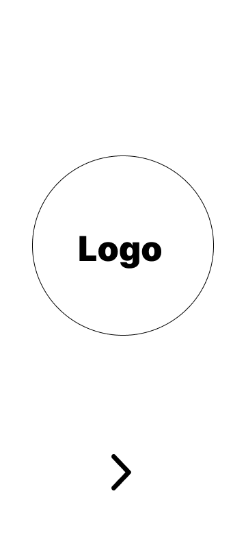
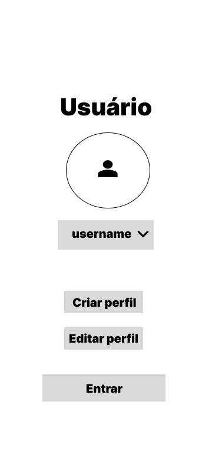
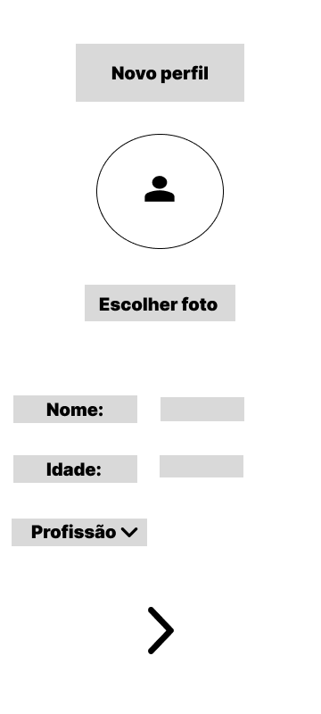

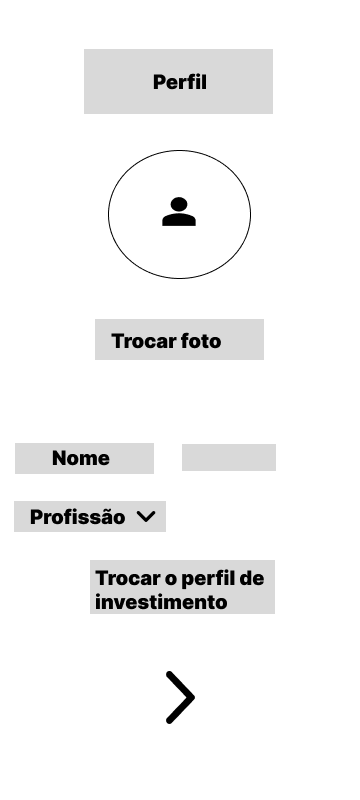
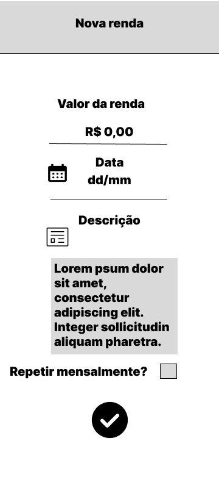

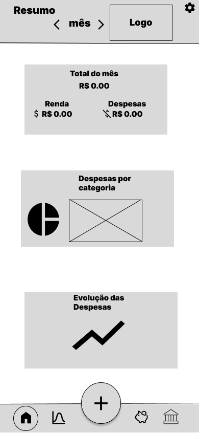
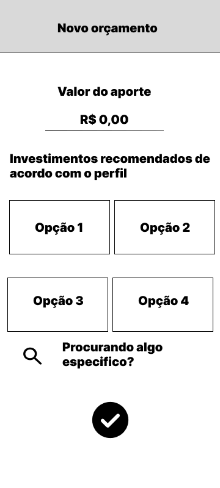
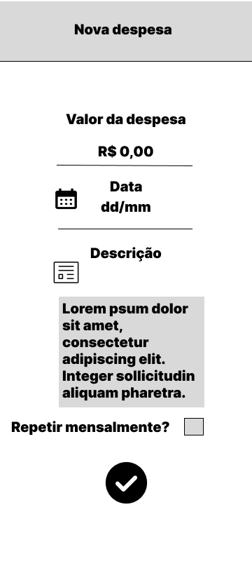
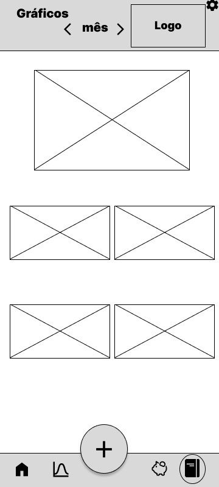
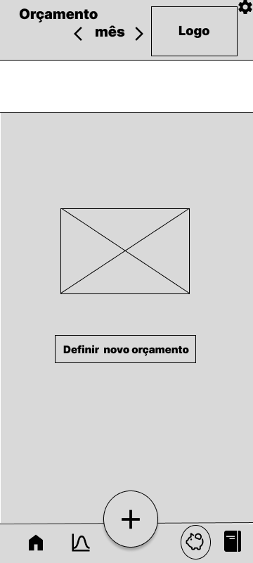
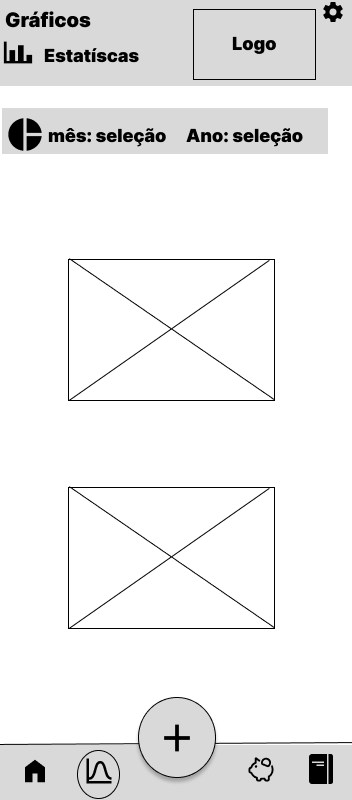
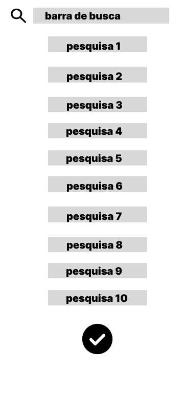
# Metodologia

......  COLOQUE AQUI O SEU TEXTO ......

Os três membros do grupo dividem as suas funções de acordo com suas habilidades e personalidades. Vitor Silva é o Scrum Master,além de idealizador do projeto,sendo responsável  por liderar o grupo,fiscalizar se os papéis estão sendo cumpridos além de um importante papel na documentação. O Product Owner é o Fernando Theodoro,que já possui  conhecimentos e experiência na área administrativa,coordena as tarefas e funções e às registram em plataformas como o Trello. Já o Desenvolvimento está sendo gerenciado pelo Gabriel Rezende,que já possui bastante experiência com programação e em plataformas como Github,colocando em prática as idéias da equipe.
https://trello.com/b/iflPTsCN/financiart

## Divisão de Papéis

......  COLOQUE AQUI O SEU TEXTO ......

> Apresente a divisão de papéis e tarefas entre os membros do grupo.
>
> **Links Úteis**:
> - [11 Passos Essenciais para Implantar Scrum no seu Projeto](https://mindmaster.com.br/scrum-11-passos/)
> - [Scrum em 9 minutos](https://www.youtube.com/watch?v=XfvQWnRgxG0)

## Ferramentas

| Ambiente  | Plataforma              |Link de Acesso |
|-----------|-------------------------|---------------|
|Processo de Design Thinkgin  | Miro |  https://miro.com/app/board/uXjVMYDTJcA=/ | 
|Repositório de código | GitHub | https://github.com/ICEI-PUC-Minas-PPLCC-TI/ti-1-ppl-cc-m-20231-finaciart | 
|Hospedagem do site | AWS |  *pendente* | 
|Protótipo Interativo | Figma |  (https://www.figma.com/file/ZaEeyCCSmwGHb2qUdjBRHC/Wireframe-TI?node-id=0-1&t=bzBAIX5iDiGVfkHs-0) |   
> As ferramentas empregadas no projeto são:
> 
> - Editor de código: Visual code
> - Ferramentas de comunicação: Discord
> - Ferramentas de diagramação: Figma
> - Plataforma de hospedagem: AWS
> 
>O uso do Visual Code é recomendado por ser um editor de código poderoso e versátil, com integração com várias linguagens de programação e recursos de formatação, >depuração e controle de versão.
>
>O Discord é uma ferramenta de comunicação em equipe que facilita o compartilhamento de informações e a colaboração em tempo real, com chat de voz e texto e a possibilidade de criar canais específicos para tópicos de discussão.
>
>Para diagramação e prototipagem, o Figma é uma ferramenta de design de interface do usuário (UI) com recursos de colaboração em tempo real e bibliotecas de componentes reutilizáveis.
>
>A plataforma de hospedagem AWS é altamente escalável e confiável, com uma ampla gama de serviços de hospedagem, incluindo servidores virtuais, bancos de dados e serviços de armazenamento, tornando-se uma excelente escolha para empresas que esperam crescer rapidamente.

## Controle de Versão
> A ferramenta de controle de versão adotada no projeto foi o
> [Git](https://git-scm.com/), sendo que o [Github](https://github.com)
> foi utilizado para hospedagem do repositório `financiart`.
> 
> O projeto segue a seguinte convenção para o nome de branchs:
> 
> - `master`: versão estável já testada do software
> - `unstable`: versão já testada do software, porém instável
> - `testing`: versão em testes do software
> - `dev`: versão de desenvolvimento do software
> 
> Quanto à gerência de issues, o projeto adota a seguinte convenção para
> etiquetas:
> 
> - `bugfix`: uma funcionalidade encontra-se com problemas
> - `enhancement`: uma funcionalidade precisa ser melhorada
> - `feature`: uma nova funcionalidade precisa ser introduzida

# **############## SPRINT 1 ACABA AQUI #############**

# Projeto da Solução

......  COLOQUE AQUI O SEU TEXTO ......

## Tecnologias Utilizadas

......  COLOQUE AQUI O SEU TEXTO ......

> Descreva aqui qual(is) tecnologias você vai usar para resolver o seu
> problema, ou seja, implementar a sua solução. Liste todas as
> tecnologias envolvidas, linguagens a serem utilizadas, serviços web,
> frameworks, bibliotecas, IDEs de desenvolvimento, e ferramentas.
> Apresente também uma figura explicando como as tecnologias estão
> relacionadas ou como uma interação do usuário com o sistema vai ser
> conduzida, por onde ela passa até retornar uma resposta ao usuário.
> 
> Inclua os diagramas de User Flow, esboços criados pelo grupo
> (stoyboards), além dos protótipos de telas (wireframes). Descreva cada
> item textualmente comentando e complementando o que está apresentado
> nas imagens.

## Arquitetura da solução

......  COLOQUE AQUI O SEU TEXTO E O DIAGRAMA DE ARQUITETURA .......

> Inclua um diagrama da solução e descreva os módulos e as tecnologias
> que fazem parte da solução. Discorra sobre o diagrama.
> 
> **Exemplo do diagrama de Arquitetura**:
> 
> 

# Avaliação da Aplicação

......  COLOQUE AQUI O SEU TEXTO ......

> Apresente os cenários de testes utilizados na realização dos testes da
> sua aplicação. Escolha cenários de testes que demonstrem os requisitos
> sendo satisfeitos.

## Plano de Testes

......  COLOQUE AQUI O SEU TEXTO ......

> Enumere quais cenários de testes foram selecionados para teste. Neste
> tópico o grupo deve detalhar quais funcionalidades avaliadas, o grupo
> de usuários que foi escolhido para participar do teste e as
> ferramentas utilizadas.
> 
> **Links Úteis**:
> - [IBM - Criação e Geração de Planos de Teste](https://www.ibm.com/developerworks/br/local/rational/criacao_geracao_planos_testes_software/index.html)
> - [Práticas e Técnicas de Testes Ágeis](http://assiste.serpro.gov.br/serproagil/Apresenta/slides.pdf)
> -  [Teste de Software: Conceitos e tipos de testes](https://blog.onedaytesting.com.br/teste-de-software/)

## Ferramentas de Testes (Opcional)

......  COLOQUE AQUI O SEU TEXTO ......

> Comente sobre as ferramentas de testes utilizadas.
> 
> **Links Úteis**:
> - [Ferramentas de Test para Java Script](https://geekflare.com/javascript-unit-testing/)
> - [UX Tools](https://uxdesign.cc/ux-user-research-and-user-testing-tools-2d339d379dc7)

## Registros de Testes

......  COLOQUE AQUI O SEU TEXTO ......

> Discorra sobre os resultados do teste. Ressaltando pontos fortes e
> fracos identificados na solução. Comente como o grupo pretende atacar
> esses pontos nas próximas iterações. Apresente as falhas detectadas e
> as melhorias geradas a partir dos resultados obtidos nos testes.

# Referências

......  COLOQUE AQUI O SEU TEXTO ......

> Inclua todas as referências (livros, artigos, sites, etc) utilizados
> no desenvolvimento do trabalho.
> 
> **Links Úteis**:
> - [Formato ABNT](https://www.normastecnicas.com/abnt/trabalhos-academicos/referencias/)
> - [Referências Bibliográficas da ABNT](https://comunidade.rockcontent.com/referencia-bibliografica-abnt/)
